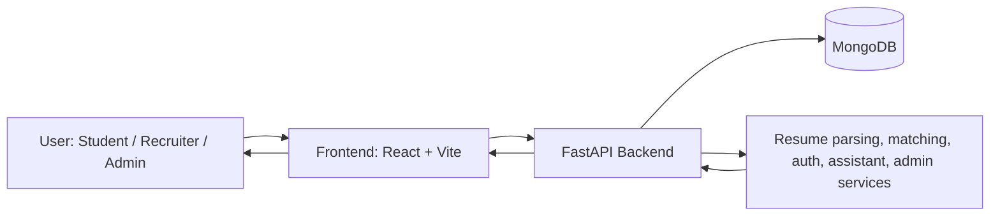

# ResumeIQ

ResumeIQ is a full-stack applicant tracking system for students, recruiters, and administrators. It supports resume upload, job posting upload, matching, assistant-led guidance, and admin visibility into platform activity.

## What This Project Does

- Accepts resumes and job descriptions from users.
- Extracts text and useful skills from uploaded files.
- Matches candidates to jobs and jobs to candidates.
- Provides a chat assistant for resume and hiring questions.
- Gives admins a consolidated view of users, logins, uploads, and activity.

## Architecture

The application is split into three main layers:

- Frontend: a React + TypeScript single-page app with route-based dashboards.
- Backend: a FastAPI service that handles auth, file handling, matching logic, and admin APIs.
- Data layer: MongoDB for users, documents, jobs, audit events, and matching data.

The frontend talks to the backend through REST APIs. The backend stores and retrieves data from MongoDB, then returns structured responses to the UI.



## Why These Technologies

- React: keeps the UI component-based and easy to extend across multiple dashboards.
- TypeScript: reduces runtime mistakes and makes shared API models safer to maintain.
- Vite: gives fast local development and efficient production builds.
- Tailwind CSS: speeds up consistent styling across the product without large custom CSS files.
- Framer Motion: adds smooth transitions, page movement, and modern dashboard interactions.
- FastAPI: provides a clean, fast Python API layer with strong request/response validation.
- MongoDB: fits flexible ATS data such as users, resumes, jobs, and audit logs.
- JWT auth: keeps login stateless and suitable for separate frontend and backend services.
- spaCy and sentence-transformer style NLP tooling: help with text extraction, skills, and matching workflows.
- Docker and Docker Compose: make local setup and deployment consistent across environments.

## Main Features

- Student dashboard for resume upload, match results, and guidance.
- Recruiter dashboard for jobs, candidate matching, and chat-based help.
- Admin dashboard for user records, login history, uploads, and audit visibility.
- Resume parsing and structured extraction from uploaded files.
- Candidate-to-job and job-to-candidate recommendation flows.
- Chat assistant for resume improvement and hiring questions.

## Backend Structure

```text
backend/app/
├── api/v1/routes/       # REST endpoints
├── core/                # config, logging, security, database, exceptions
├── models/              # persistence models
├── repositories/        # database access helpers
├── schemas/             # Pydantic request/response models
├── services/            # business logic and matching pipelines
├── utils/               # file parsing and NLP helpers
└── main.py              # FastAPI app entry point
```

### Backend Flow

1. The UI sends a request to FastAPI.
2. Routes validate the request using schemas.
3. Services perform the business logic.
4. Repositories read and write MongoDB documents.
5. The API returns a response to the frontend.

## Frontend Structure

```text
frontend/src/
├── api/                 # API client wrappers
├── components/          # shared UI pieces
├── context/             # auth and theme state
├── layouts/             # route shells
├── pages/               # dashboard and feature screens
└── main.tsx             # app bootstrap
```

### Frontend Flow

1. Users open the app in the browser.
2. React routes send them to the correct dashboard.
3. Pages call backend APIs through the shared client layer.
4. Results are rendered in cards, tables, charts, and chat panels.
5. Theme and auth state stay available across the app through context.

## Core Modules

- Authentication and registration
- Resume upload and parsing
- Job upload and listing
- Candidate recommendations
- Job recommendations
- Chat assistant
- Admin dashboard and audit views

## API Overview

Common endpoints include:

- `GET /api/v1/health` - health check
- `POST /api/v1/auth/login` - sign in
- `POST /api/v1/auth/register` - create account
- `GET /api/v1/auth/me` - current user profile
- `POST /api/v1/resumes/upload` - upload resume file
- `POST /api/v1/resumes/parse` - extract resume content
- `POST /api/v1/jobs/upload` - upload job description
- `GET /api/v1/recommendations/candidates` - find matching candidates
- `GET /api/v1/recommendations/jobs` - find matching jobs
- `POST /api/v1/chatbot/chat` - assistant conversation endpoint
- `GET /api/v1/admin/dashboard` - admin summary

## Local Setup

### Prerequisites

- Node.js 18+
- Python 3.11+
- MongoDB running locally or in Docker

### Run With Docker

```bash
docker compose up --build
```

### Run Frontend Locally

```bash
cd frontend
npm install
npm run dev
```

### Run Backend Locally

```bash
cd backend
python -m uvicorn app.main:app --host 0.0.0.0 --port 8000 --reload
```

## Environment Variables

Copy the root `.env` template used by Docker Compose and set values for:

- `MONGO_URI`
- `MONGO_DB`
- `JWT_SECRET_KEY`
- `JWT_ALGORITHM`
- `JWT_ACCESS_TOKEN_EXPIRE_MINUTES`
- `BACKEND_CORS_ORIGINS`
- `FRONTEND_API_BASE_URL`
- `OPENAI_API_KEY`
- `SPACY_MODEL`
- `SENTENCE_TRANSFORMER_MODEL`

## Project Layout

```text
ATS_GENAI/
├── backend/
├── frontend/
├── storage/
├── docker-compose.yml
└── README.md
```

## Future Goals

- Add stronger matching logic and ranking controls.
- Improve resume parsing for more file types and edge cases.
- Add background jobs for heavier parsing and indexing work.
- Add unit and integration test coverage for key flows.
- Add export and reporting features for recruiters and admins.
- Improve deployment support with environment-specific configs.
- Reduce frontend bundle size with code splitting and lazy loading.

## Notes

This project is modular by design so it can grow into a production-ready ATS without changing the core architecture.
